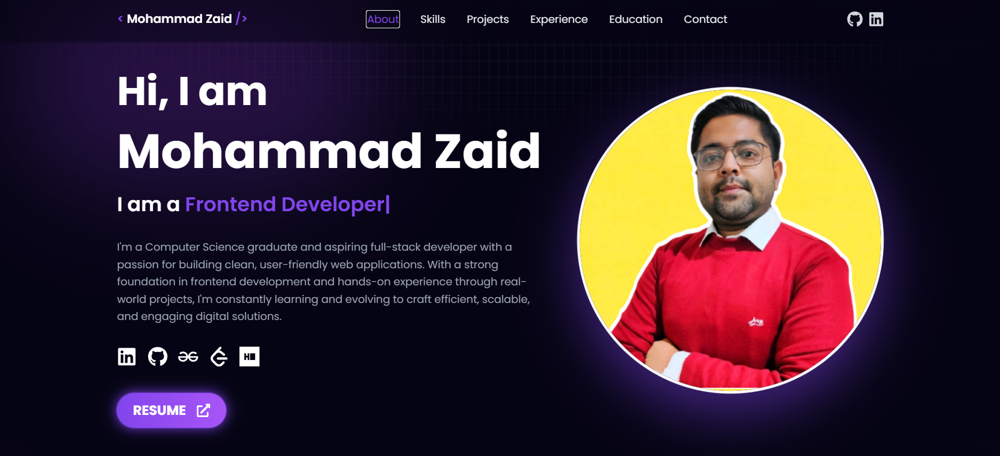

# 🚀 Portfolio — Mohammad Zaid

A sleek, interactive, and fully responsive portfolio website built with **React 19**, **Tailwind CSS**, and modern libraries. Designed to showcase skills, projects, and experience for recruiters, clients, and collaborators.

---

## 🌐 Live Demo

🔗 [View Live Portfolio](https://mohammad-zaid.vercel.app)
📂 [GitHub Repository](https://github.com/mohammadzaid07/portfolio)

---

## 🛠️ Tech Stack

- ⚛️ **React 19**
- 🎨 **Tailwind CSS** – for styling
- 🧩 **React Icons** – for elegant iconography
- 🌀 **React Type Animation** – typing text animation
- 📦 **React Toastify** – toast notifications
- 💌 **EmailJS** – send emails via contact form
- 🧲 **React Parallax Tilt** – 3D hover effects
- 🚀 **Vercel** – production-grade deployment

---

## 📁 Features

- ✅ Fully responsive on all screen sizes
- 🎯 Scroll-based section highlighting & smooth navigation
- 📬 Working contact form with EmailJS integration
- ✨ Elegant animations and hover effects
- 💡 Modular codebase with reusable components
- 🧑‍💻 Professional sections:
  - About
  - Skills
  - Projects
  - Experience
  - Education
  - Contact

---

## 🚀 Getting Started

### 1. Clone the Repo

```bash
git clone https://github.com/mohammadzaid07/portfolio.git
cd portfolio
```

### 2. Install Dependencies

```
npm install
```

### 3. Setup EmailJS

Create a `.env` file in the root with:

```
VITE_EMAILJS_SERVICE_ID=your_service_id
VITE_EMAILJS_TEMPLATE_ID=your_template_id
VITE_EMAILJS_API_PUBLIC_KEY=your_public_key
```

> 🔑 Replace with your actual credentials from [EmailJS Dashboard](https://dashboard.emailjs.com/admin/account).

### 4. Run Locally

```
npm run dev
```

### 5. Build for Production

```
npm run build
```

---

## ✨ Screenshot



---

## 📦 Deployment

This project is optimized for  **Vercel** . Just push to GitHub and import your repo on [vercel.com]().

Or deploy manually:

```
npm run build
```

Upload the `dist/` folder to any static host.

---

## 🙌 Acknowledgements

Built and customized by [**Mohammad Zaid**](https://www.linkedin.com/in/mohammadzaid07/), inspired by [Tarun Kaushik](https://github.com/codingmastr/Tarun-s-Portfolio)'s Portfolio

> Special thanks to Tarun Kaushik for the original concept and inspiration.
>
> If you like this project, feel free to ⭐ the repo and share it!
